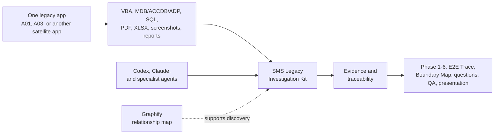

# SMS Legacy Investigation Kit

[](LICENSE)
[](specifications/package.json)

## What is this?

SMS Legacy Investigation Kit is a reusable **operating kit for investigating legacy business applications** built with Microsoft Access/VBA and SQL Server.

Use it once for each independent satellite application—for example A01, A03, or another Access/VBA app. It gives Codex, Claude, and other agents one evidence-backed way to turn legacy sources into a clear business and technical understanding.

It is not the replacement SMS application. It does not migrate code automatically. It does not analyze or connect to a database until an authorized app workspace and sources are provided.



## What problem does it solve?

Without a shared method, each agent may investigate a legacy app differently, mix facts between apps, or produce a presentation without traceable proof. This kit makes the investigation repeatable:

- Keep each app's sources, evidence, decisions, runs, and outputs isolated.
- Follow the same mandatory six-phase analyst workflow.
- Trace business behavior from screen/form to VBA, SQL, table/file, and output.
- Let specialists work in parallel while one coordinator controls canonical results.
- Produce handover-ready Phase documents, E2E Trace, Boundary Map, QA, and presentation inputs.

## What it is not

- Not a replacement-system implementation or code-migration framework.
- Not an A01-only repository; A01 is only a future regression corpus when explicitly authorized.
- Not an autonomous database crawler. Live Access, ADP, and SQL Server access require approval.
- Not a Graphify wrapper. Graphify supports discovery but never replaces source evidence or the six phases.
- Not a collection of separate Codex and Claude instructions. One root `SKILL.md` is canonical for every runtime.

## Input to output

For one app workspace, provide only authorized sources:

- Exported Access VBA/forms/reports; optionally `.mdb`, `.accdb`, or `.adp` files.
- SQL Server tables, views, queries, or stored procedures.
- Japanese operational manuals, report lists, business-flow PDFs, and screenshots.
- Optional `compile_commands.json` for non-Access compiled-language context.

The kit produces:

1. Phase 1 — Data Understanding
2. Phase 2 — Screen & Form Analysis
3. Phase 3 — Logic & Processing
4. Phase 4 — Workflow Reconstruction
5. Phase 5 — Document Integration
6. Phase 6 — Synthesis
7. Evidence records, traceability, E2E Trace HTML, Boundary Map HTML, question list, QA report, and presentation-ready inputs/PPTX outputs.

## How one app uses the kit

1. Initialize an isolated workspace for the app, such as `A03`.
2. Declare scope and authorized sources in its `manifest.yaml`.
3. Run preflight; extract Access/build context only when authorized.
4. Build a component index and leaf-first module plan when sources need decomposition.
5. Run Phases 1–6 in order and preserve source-backed evidence.
6. Validate traceability and QA, then render the E2E Trace, Boundary Map, and presentation.

The package itself stays shared. Generated sources, graphs, evidence, run state, and outputs belong to the individual app workspace—not this repository.

## Multi-agent operating model

Specialists can collect evidence in parallel by source type or affected leaf module. They cannot publish canonical Phase files. The coordinator merges validated handoffs, preserves conflicts, and releases phases sequentially.

This makes the kit compatible with Codex, Claude, and generic agents without allowing agent-specific behavior to change the investigation contract.

## Current status and safety boundary

Version 2.1.4 is packaged and synthetic-smoke-tested. Live Access/ADP extraction, live SQL Server access, and the A01 regression corpus are intentionally outside the public test baseline.

- Never open the original Access database; executable extraction uses a hash-verified snapshot.
- Never execute `command` or `arguments` values from `compile_commands.json`.
- Never commit production databases, credentials, DSNs, connection secrets, customer documents, or investigation runs.
- Exclude the current replacement implementation unless the manifest and user explicitly include comparison.

## Quick start

Validate the shared package:

```powershell
cd sms-legacy-investigation-kit
py -3.11 -m pip install -r requirements-dev.txt
py -3.11 scripts/validate_structure.py --package .
py -3.11 -m pytest -q
```

Initialize an isolated app workspace:

```powershell
py -3.11 scripts/init_app.py `
  --root D:\investigations `
  --app-id A03 `
  --name-en "A03 Legacy Application" `
  --runtime generic
```

Edit the generated `manifest.yaml`, put authorized sources in the declared folders, and run preflight:

```powershell
py -3.11 scripts/preflight.py `
  --package . `
  --runtime generic `
  --manifest D:\investigations\A03\manifest.yaml
```

## Optional preprocessing

Run Access preflight without copying or opening the database:

```powershell
py -3.11 scripts/extract_access.py `
  --database <ACCESS_FILE> `
  --database-id <DATABASE_ID> `
  --output-dir <APP_ROOT>/extracted/access `
  --dry-run
```

Then normalize optional build context and build the module plan:

```powershell
py -3.11 scripts/parse_compilation_database.py --input <compile_commands.json> --output <APP_ROOT>/extracted/build-context/compile_commands.normalized.json
py -3.11 scripts/build_component_index.py --app-root <APP_ROOT>
py -3.11 scripts/build_module_plan.py --component-index <component-index.json> --output-dir <APP_ROOT>/extracted/module-plan
```

Read [SKILL.md](SKILL.md) for the canonical agent procedure, [the Access extraction guide](references/access-extraction-guide.md) for runtime safeguards, and [the orchestration guide](references/orchestration-guide.md) for multi-agent execution.

## Source and ignore policies

- `.gitignore` controls repository tracking.
- `.graphifyignore` controls Graphify input.
- `.investigationignore` in each app workspace controls the immutable source inventory.

These policies are deliberately independent. An ignored inventory entry is recorded with its matching rule instead of being silently omitted.

## Requirements

Required: Python 3.10+ and an agent runtime capable of coordinator/worker execution. CI uses Python 3.11.

Conditional: Microsoft Access/ACE and Windows PowerShell for MDB/ACCDB extraction; a compatible legacy Access environment for ADP; `pyodbc` plus a Microsoft SQL Server ODBC driver only for authorized live SQL access; and Graphify, spreadsheet, document, presentation, OCR, or browser capabilities only when their outputs are requested.

CodeWiki is not installed, imported, or vendored. V2.1 independently implements selected architectural patterns: component indexing, hierarchical decomposition, leaf-first ordering, session isolation, and affected-module refresh.

## Contributing and security

See [CONTRIBUTING.md](CONTRIBUTING.md) before submitting changes. Do not report vulnerabilities or accidental sensitive-data exposure in a public issue; follow [SECURITY.md](SECURITY.md).

## License and acknowledgements

Licensed under the [Apache License 2.0](LICENSE). Copyright 2026 Vo Ta Tuan.

See [NOTICE](NOTICE) and [THIRD_PARTY_NOTICES.md](THIRD_PARTY_NOTICES.md) for attribution and architectural acknowledgements.
