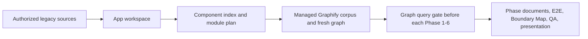

# Access Modernization Kit

[](LICENSE)
[](https://github.com/tuanvtanrakutei/access-modernization-kit/releases/latest)

An agent skill for investigating a legacy Microsoft Access/VBA and SQL Server application, one app at a time. It turns authorized source material into the six analyst phases, evidence, E2E Trace, Boundary Map, QA report, and presentation inputs.

## Install in Codex

You do **not** need to clone this repository or create a link in an agent folder. Add the public marketplace once, then install the plugin:

```powershell
codex plugin marketplace add tuanvtanrakutei/access-modernization-kit --sparse .agents/plugins --sparse plugins/ak
codex plugin add ak@access-modernization-kit
```

Start a new Codex conversation after installation. Codex manages the installed plugin location and discovers `$ak` automatically.

> To pin a specific release instead of the latest, add `--ref vX.Y.Z` to the marketplace command (for example `--ref v2.3.0`). See the [releases page](https://github.com/tuanvtanrakutei/access-modernization-kit/releases).

To update later:

```powershell
codex plugin marketplace upgrade access-modernization-kit
codex plugin add ak@access-modernization-kit
```

## Install in Claude Code

You do **not** need to clone this repository. Add the marketplace once, then install the plugin:

```text
/plugin marketplace add tuanvtanrakutei/access-modernization-kit
/plugin install ak@access-modernization-kit
```

Restart the session after installation. Claude Code discovers the `ak` skill automatically. To update later, run `/plugin marketplace update access-modernization-kit` and reinstall.

## Use it with an agent

In Codex, select **Access Modernization Kit** from `/skills`, or include `$ak` in your request. These are agent messages, not PowerShell commands.

| Goal | Say this to the agent |
|---|---|
| Create an empty workspace | `$ak init <APP_ID>` |
| Check sources and missing inputs | `$ak assess <APP_ID>` |
| Run a specific phase | `$ak phase 1 <APP_ID>` |
| Run the six phases | `$ak run <APP_ID>` |
| View progress only | `$ak status <APP_ID>` |
| Produce final approved outputs | `$ak render <APP_ID> English` |

Example:

```text
Use $ak to investigate <APP_ID> from the authorized sources.
Run the six phases and produce English Phase documents, an E2E Trace,
a Boundary Map, a QA report, and presentation inputs.
```

`run` does not grant live Access/ADP extraction or live SQL Server access. Those require separate approval.

Graphify is prepared automatically when a Phase/run starts. The kit creates a
pinned isolated runtime when Graphify is missing, normalizes supported code and
documents into a binary-free corpus, then builds or refreshes the app graph and
runs a phase-specific query. Users do not install Graphify into system Python.
If installation, OCR/document conversion, graph freshness, or the query gate
cannot be validated, the agent stops and reports the exact blocker before
creating Phase output.

## Set up one app workspace

For a new empty folder, ask the agent for `$ak init <APP_ID>`. For an existing app project, explicitly ask it to adopt <APP_ROOT> without changing current files. The optional CLI is:

```powershell
py -3.11 plugins\ak\scripts\ak.py init `
  --root <WORKSPACE_ROOT> `
  --app-id <APP_ID> `
  --name-en "<APP_NAME>"
```

For an existing non-empty app project, use --app-root <APP_ROOT> and --adopt-existing instead of --root. The initializer preserves existing files and creates only missing kit-owned folders/files.

For a guided, safe first run against an existing local Access MDB workspace, see [First investigation of an existing Access MDB workspace](docs/first-access-mdb-investigation.md).

Put the application's authorized exports and documents in that workspace. Each application has its own sources, evidence, graph, decisions, runs, and outputs; the installed plugin remains shared.



## What you provide

- Access VBA exports, forms, reports, or authorized MDB/ACCDB/ADP snapshots
- SQL Server schemas, queries, and stored procedures
- Japanese manuals, XLSX lists, PDFs, screenshots, and reports

## What you receive

1. Data understanding
2. Screen and form analysis
3. Logic and processing analysis
4. End-to-end workflow reconstruction
5. Document integration and mismatch review
6. System synthesis with risks, assumptions, and unknowns

Plus traceable evidence, a question list, QA report, E2E Trace, Boundary Map, and presentation-ready material.

## Use with another agent runtime

For Claude Code, prefer the marketplace install above. For another compatible runtime (or a project-scoped manual link without a marketplace), first obtain the package (clone/download or use its local plugin cache), then ask an agent to run:

```text
$ak install claude <PROJECT_PATH>
```

That creates the project-scoped Claude skill link. The six-phase contract and outputs stay the same.

<details>
<summary>Advanced: local validation, extraction, and architecture</summary>

The CLI is for local setup and package checks, not normal investigation work:

```powershell
py -3.11 plugins\ak\scripts\ak.py validate
py -3.11 plugins\ak\scripts\ak.py preflight --app-root <APP_WORKSPACE>
```

The kit supports controlled Access extraction, `pyodbc`/Microsoft SQL Server ODBC access when explicitly authorized, Graphify-assisted discovery, optional compilation-database context, and provider-neutral multi-agent processing. It does not include CodeWiki as a dependency. Read the installed skill or the package files under `plugins/ak/` only when maintaining the kit.
</details>

## Safety

- Never commit production databases, credentials, DSNs, customer documents, or investigation runs.
- Access extraction works from a hash-verified snapshot; never open the original database.
- The current replacement implementation stays outside scope unless explicitly included.

## Contributing and security

See [CONTRIBUTING.md](CONTRIBUTING.md) and [SECURITY.md](SECURITY.md). Licensed under the [Apache License 2.0](LICENSE). Copyright 2026 Vo Ta Tuan.
