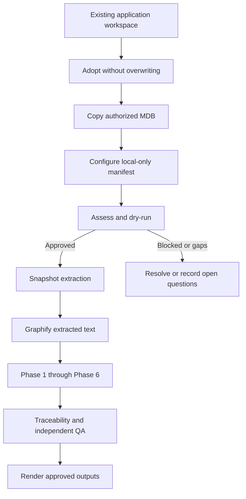

# First investigation of an existing local Access MDB workspace

This runbook is for an existing project that contains a local Microsoft Access `.mdb` application. It does not assume SQL Server access. Use the same process for `.accdb`; use the SQL Server boundary workflow separately for linked tables or `.adp` projects.

The goal is to create an evidence-backed investigation workspace without altering the current project or opening the original database file.

## Before you start

Confirm all of the following:

- `ak` version 2.6.2 or later is installed in Codex.
- The application workspace already exists and may contain documents or exported code.
- You have a copyable Access database file. Never provide the production/original MDB for extraction.
- You know whether the app is local-only or has linked tables. If unknown, record it as an open question.
- For executable extraction, a compatible Windows Access runtime is available. The runtime bitness must be recorded, for example `32-bit`.

Do not start the application just to perform this setup. A dry run and app adoption do not open the database.

## 1. Adopt the existing workspace

In Codex, send this agent request and replace the placeholders:

```text
Use $ak to adopt the existing workspace <APP_ROOT>.
App ID: <APP_ID>.
English name: <APP_NAME>.
Preserve all current files, especially docs.
Do not analyze, extract, or access the MDB yet.
```

For a non-empty workspace, the agent must use the explicit adoption mode equivalent to:

```powershell
py -3.11 plugins\ak\scripts\ak.py init `
  --app-root <APP_ROOT> `
  --app-id <APP_ID> `
  --name-en "<APP_NAME>" `
  --adopt-existing
```

Adoption preserves existing files. It creates only missing kit-owned locations, including `sources/`, `extracted/`, `evidence/`, `outputs/`, `runs/`, `manifest.yaml`, `.investigationignore`, `.gitignore`, and `.graphifyignore`.

Stop and review the resulting file tree before continuing.

## 2. Add authorized source copies

Copy, do not move, the MDB into the adopted workspace:

```text
<APP_ROOT>/sources/access/<database-copy>.mdb
```

Keep authorized VBA exports in `sources/vba/` and business documents in `sources/documents/` where practical. Split Access applications may instead keep exports under database-specific paths such as `sources/A05_FRONTEND/vba/` and `sources/A05_DATA/vba/`; declare every such path in `sources.vba_exports`. Existing project documentation may remain in its current folder if the manifest records its role and source path.

Never commit Access databases, credentials, customer documents, raw extraction sessions, or agent run state. The generated ignore files are designed for this policy.

## 3. Configure the local-only scope

Ask the agent to update and review the manifest:

```text
Use $ak to configure <APP_ID> for a local-only, <BITNESS> Microsoft Access MDB application.
The copied database is at sources/access/<database-copy>.mdb.
SQL Server is not applicable for this app.
Keep the existing documents as authorized business-document sources.
Do not extract or analyze yet.
```

The manifest should identify the Access database source, runtime bitness, known human languages and encodings, and local-only/SQL-Server-not-applicable status. Do not put passwords, DSNs, or connection strings in the manifest.

## 4. Assess and preflight

First ask for a non-mutating review:

```text
$ak assess <APP_ID>
```

The assessment should report source coverage, missing information, extraction capability, and approvals required. It is not a phase analysis.

Then authorize only the database dry run:

```text
For <APP_ID>, run Access extraction dry-run only.
Do not open, copy, or modify the MDB.
Do not start Phase analysis.
```

Dry run verifies the command, file location, and compatible runtime prerequisites without opening the database.

## 5. Authorize snapshot extraction

After reviewing the dry-run result, explicitly authorize extraction:

```text
For <APP_ID>, extract the copied MDB from a hash-verified disposable snapshot.
Never open or modify the original MDB.
Record blocked or partial extraction results as evidence gaps.
Do not start Phase analysis yet.
```

The extractor inventory may include local and linked tables, relationships, QueryDefs, forms, reports, macros, VBA modules, startup properties, and Access/VBA references. A linked table is a boundary: it is not evidence that a live external database has been analyzed.

## 6. Prepare the Graphify discovery map

Graphify runs only after extraction or pre-exported sources have produced text
and normalized metadata. You do not need a separate system-Python install: the
first Phase request bootstraps the version-pinned managed runtime when needed.
To prepare the graph without starting a Phase, ask:

```text
Prepare or update the Graphify graph for <APP_ID> from the kit-normalized binary-free corpus.
Never ingest an MDB/ACCDB/ADP, lock file, or disposable snapshot.
Report graph coverage and gaps. Do not start a Phase analysis yet.
```

The graph is stored per app, normally in `<APP_ROOT>/graphify-out/`. The corpus
normalizer supports UTF-8/CP932/Shift-JIS text and Access VBA, CSV/TSV, XLS/XLSX,
DOCX, PPTX, and text-layer PDFs. Scanned PDFs/images require Tesseract and the
appropriate language data; unsupported legacy DOC/PPT files are reported for
conversion. It helps navigate relationships such as form -> event -> VBA module
-> query/table -> report/output. Its `INFERRED` edges are investigation leads,
not evidence. Phase conclusions must still cite source locations.

## 7. Run the investigation one phase at a time

Review each phase before moving to the next. Before every command, the kit
rechecks the corpus fingerprint, refreshes the graph when sources changed, and
requires a phase-specific Graphify query receipt. A stale or missing graph
blocks the Phase rather than silently falling back to broad source search.

```text
$ak phase 1 <APP_ID>
```

Continue only after review:

```text
$ak phase 2 <APP_ID>
```

Repeat through Phase 6. The required order is:

1. Phase 1 — Data Understanding
2. Phase 2 — Screen & Form Analysis
3. Phase 3 — Logic & Processing
4. Phase 4 — Workflow Reconstruction
5. Phase 5 — Document Integration
6. Phase 6 — Synthesis

Use `$ak run <APP_ID>` only when you explicitly authorize the entire six-phase investigation. It never grants authorization to access a live database.

## 8. Render the final deliverables

After Phase 6, traceability checks, decisions, and independent QA pass, request the declared output language:

```text
$ak render <APP_ID> English
```

Expected deliverables include the Phase documents, E2E Trace, Boundary Map, question list, QA report, and presentation inputs. Rendering a final presentation is gated; it is not a substitute for evidence review.

## Decision flow


